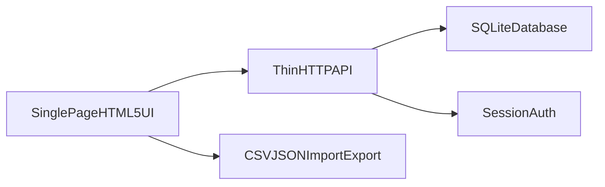

# ShotTrack - Product Requirements Document (PRD)

**Document type:** PRD (v1)  
**Product name:** ShotTrack  
**Primary surface:** One-page hosted web app (desktop-first)  
**Positioning:** A lightweight "mini ShotGrid" for small VFX teams, optimized around a fast spreadsheet-style shotlist similar in spirit to `ctrack_v0` shotlist patterns, but intentionally smaller in scope.

---

## 1) Executive summary

ShotTrack is a **small-team hosted** production tracking tool that gives supervisors/producers a **single powerful shotlist page** to manage shots, tasks, deliveries/versions, client feedback cycles, and notes - without the operational overhead of a full studio pipeline system.

The product core promise is **speed + clarity**: update status inline, see delivery history at a glance, and instantly understand risk (kickbacks, overdue due dates, blocked tasks) through row-level visual language.

---

## 2) Problem statement

Small VFX teams often track shots across spreadsheets, chat threads, and ad-hoc notes. This causes:

- **Lost context** between "what was delivered" vs "what the client approved"
- **Slow updates** when status changes require many clicks across multiple tools
- **Weak accountability** for who owns which task and what the next delivery target is
- **Fragile collaboration** when datasets are local-only or shared via manual exports

ShotTrack solves this by centralizing the **shot-centric truth** in one hosted workspace with a spreadsheet-first UI.

---

## 3) Goals

### 3.1 Product goals

- Provide a **one-page shotlist** that supports daily production workflows end-to-end for a small team.
- Make **delivery/version cycles** first-class: v1/v2/v3 with dates, notes, and explicit client outcomes.
- Reduce time-to-update for common actions (assign, task status, add version, kickback, note).
- Support **hosted multi-user** collaboration with roles and an auditable history.

### 3.2 Non-goals (explicit for v1)

See section 12 for a fuller list; the headline is: ShotTrack is **not** a full studio ERP, asset manager, render manager, dailies platform, or accounting system.

---

## 4) Target users and personas

### 4.1 Primary users

- **Producer / VFX supervisor:** owns schedule, priorities, client communication, delivery targets.
- **Department leads / comp supervisors:** manage task breakdown and assignments.
- **Artists:** need clarity on what to work on next and what changed after feedback.

### 4.2 Secondary users

- **Client / external reviewer (optional):** review-only access (if enabled by admin).

---

## 5) Product principles (UX + workflow)

Borrowed from proven `ctrack_v0` shotlist patterns, simplified for ShotTrack:

- **Spreadsheet speed over dashboards:** the shotlist is the home screen; everything else is a panel/modal.
- **Shot-centric truth:** tasks and versions roll up to a shot row; the row tells the story quickly.
- **Inline edits for high-frequency fields:** status, due dates, assignments, task states.
- **Strong filtering:** search + multi-filters + saved views/presets.
- **Visual risk language:** row highlight/border/badge communicates "needs attention" without opening details.
- **Desktop-first:** mobile can be read-only friendly, but v1 targets workstation workflows.

---

## 6) Scope: MVP (v1)

### 6.1 One-page application structure

ShotTrack v1 is organized as a **single primary route** containing:

- **Sticky top toolbar:** project context, global actions, import/export, settings entry, user menu
- **Filter + view controls row:** search, sequence, status, artist, task filters, grouping, column visibility, saved presets
- **Main grid:** grouped rows (default: group by sequence), inline editable cells
- **Right-side inspector (drawer) OR modal:** shot detail: notes, tasks, version timeline, activity log

### 6.2 Core entities (v1)

- **Project**
- **Sequence** (optional hierarchy: Episode -> Sequence can be a v1.5 expansion; v1 can model episode as optional grouping metadata)
- **Shot**
- **Task** (per shot; typed by discipline/task template)
- **DeliveryVersion** (delivery record per shot; v1/v2/v3)
- **Note** (shot notes; optionally linked to a version)
- **User**
- **Team settings:** task templates, status presets, discipline list, saved views

### 6.3 Core features (v1)

#### Shotlist grid (primary)

- Columns (baseline set; configurable visibility):
  - Sequence, Shot code, Description/summary
  - Overall shot status
  - Priority
  - Due date / delivery target date (support both: internal due vs client delivery target)
  - Assigned owner (shot owner) + optional task assignees surfaced as compact chips
  - Task rollup (compact per-discipline indicators)
  - Latest delivery label (example: `v3`) + latest delivery state
  - Bid/estimate fields (optional column; permission-gated)
- **Grouping:** default group by sequence; optional flat list mode
- **Sorting:** shot code, due date, priority, status, last activity
- **Bulk actions (minimal v1):** multi-select rows -> set status, assign owner, set due date, add tag (if tags exist)

#### Tasks

- Add/edit tasks on a shot
- Task fields: name/type, status, assignee, due date, estimate hours (optional), blocked flag + blocked reason (optional)
- "Discipline columns" mode (optional v1 if timeboxed): dynamic columns per active discipline template (inspired by `ctrack_v0` shotlist design notes; can ship as v1.5 if needed)

#### Delivery versions

- Create delivery records: `v1`, `v2`, ... (auto-increment per shot)
- Fields: delivery datetime, label/name (optional), submitted-by, notes, attachment links (URL-only in v1)
- Version outcomes (baseline):
  - `delivered`, `in_client_review`, `kickback`, `approved`, `final` (exact enum finalized in implementation; see automation section)

#### Client kickback workflow (flagship)

- Marking a delivery as **kickback** triggers:
  - Shot row highlight (example: red tint + left border)
  - Shot status moves to **needs_revision** (wording in UI can be "Revision")
  - Optional: auto-set priority to High/Urgent (toggle in team settings)

#### Notes

- Rich text not required in v1; plain text is sufficient
- Notes can be pinned (optional) and show a badge on row

#### Settings / admin (minimal but real)

- Manage disciplines/task templates
- Manage default statuses and automation toggles
- Manage users and roles (admin)
- Saved views/presets (personal + team presets if feasible; personal-only acceptable for v1)

#### Import / export

- **JSON export/import** of project data (full fidelity)
- **CSV import** for shots (baseline), and CSV export of current filtered grid

#### Collaboration requirements

- Real-time updates are **not required** for v1; periodic refresh/polling acceptable
- **Audit log** per shot and per project for key changes (status, assignment, version outcomes)

---

## 7) Detailed workflows

### 7.1 Daily supervisor workflow

1. Open ShotTrack -> lands on **Shotlist** for selected project
2. Apply saved view "Delivery this week"
3. Scan highlighted rows for kickbacks and overdue due dates
4. Click a shot -> drawer shows version timeline + tasks
5. Update task assignee/status inline -> returns to grid with updated rollups

### 7.2 Delivery cycle workflow

1. Artist lead creates `vN` delivery on shot with timestamp + note
2. Shot moves to `client_review` (automation)
3. Client feedback arrives -> supervisor marks version `kickback` with note
4. Shot becomes `needs_revision` and row highlights
5. Team completes fixes -> new `vN+1` delivery created
6. On approval, mark version `approved`; shot becomes `approved` and highlight clears (success styling optional)

### 7.3 Onboarding a new project

- Admin creates project -> imports CSV shots -> sequences inferred or mapped -> assigns owners -> sets discipline templates

---

## 8) Status model + automation rules

### 8.1 Recommended enumerations

**Shot.status (v1 baseline)**

- `not_started`
- `in_progress`
- `internal_review`
- `client_review`
- `needs_revision` (kickback / revision)
- `approved`
- `final` (optional if `approved` suffices)
- `on_hold`

**DeliveryVersion.status**

- `draft` (optional)
- `delivered` (submitted)
- `in_client_review`
- `kickback`
- `approved`
- `superseded` (optional; auto-set when newer version is promoted)

**Task.status (baseline)**

- `not_started`, `in_progress`, `blocked`, `internal_review`, `done`

### 8.2 Automation (default rules; team-toggle where noted)

**Rule A - First delivery**

- When first `DeliveryVersion` is created for a shot:
  - If shot was `not_started` -> set `in_progress`

**Rule B - Submitted to client**

- When a delivery is marked `in_client_review`:
  - Shot -> `client_review` (unless `on_hold`)

**Rule C - Kickback**

- When any delivery is marked `kickback`:
  - Shot -> `needs_revision`
  - Row styling: **risk highlight ON**
  - If setting enabled: priority escalates

**Rule D - Approval**

- When latest delivery (highest v number) is marked `approved`:
  - Shot -> `approved`
  - Risk highlight OFF
  - Optional: auto-mark tasks as `done` if all tasks are already done (toggle)

**Rule E - Supersession**

- When a newer `vN+1` is created:
  - Prior open client-review states may be marked `superseded` (optional)
  - Kickback highlight follows Rule C based on **latest relevant** delivery state (define: latest version wins)

### 8.3 Manual overrides

- Supervisors can manually set shot `on_hold` or force `approved` with justification (logged)

---

## 9) Information architecture + UI specification

### 9.1 Wireframe (compact ASCII)

```
+------------------------------------------------------------------------------+
| ShotTrack   Project:[ASD]   SavedView:[Delivery this week v]   [+] [Import] |
| Search:[________] Seq:[Allv] Status:[Allv] Artist:[Allv] Group:[Sequence v] |
| Columns:[Fields v]   AutoRefresh:[Off|On]                     [@User v][Gear]|
+------------------------------------------------------------------------------+
| [ ] Seq / Shot        Status     Due     Owner    Tasks       Latest   Notes |
+------------------------------------------------------------------------------+
| v SEQ BES (12)                                                               |
| [ ] BES BES_020      CLIENT...  04/18   Ada      CMP ROTO... v4 KB     (!)   |  <- kickback highlight
| [ ] BES BES_030      IN_PROG...  04/22   Ben      CMP...       v2       -    |
| v SEQ FRE (6)                                                                |
| ...                                                                          |
+------------------------------------------------------------------------------+
  -> Right drawer: Version timeline + Tasks + Notes + Activity
```

### 9.2 Interaction rules

- Click row (not on control) opens drawer
- Keyboard: arrow navigation optional v1.5; not required v1
- Edits save on blur or explicit Save depending on implementation; PRD requires **no silent data loss** (error toast + retry)

---

## 10) Permissions and roles

### 10.1 Roles

- **Admin:** users, team settings, imports, deletes, permissions
- **Producer/Supervisor:** edit shots/tasks/versions, overrides, notes, exports
- **Artist:** edit assigned tasks; limited shot fields (configurable)
- **Review-only:** read + comment notes (optional); cannot change delivery outcomes unless enabled

### 10.2 Permission examples (v1)

- Gate bid/estimate columns behind `can_view_bids`
- Only supervisor+ can mark `approved`
- Only supervisor+ can delete shots/versions (destructive actions)

---

## 11) Data model (conceptual)

Minimum relational model (SQLite-friendly):

- `projects(id, name, settings_json, created_at, ...)`
- `sequences(id, project_id, code, name, sort_order, ...)`
- `shots(id, project_id, sequence_id, code, description, status, priority, due_on, delivery_target_on, owner_user_id, tags_json, created_at, updated_at, ...)`
- `shot_tasks(id, shot_id, template_key, name, status, assignee_user_id, due_on, estimate_hours, blocked, blocked_reason, ...)`
- `delivery_versions(id, shot_id, version_number, status, delivered_at, note, created_by, ...)`
- `notes(id, shot_id, body, created_by, created_at, pinned, optional_delivery_version_id, ...)`
- `audit_events(id, entity_type, entity_id, actor_user_id, action, payload_json, created_at)`

**JSON usage:** `settings_json` / `tags_json` / `payload_json` are acceptable for v1 velocity, but core relations should remain normalized.

---

## 12) Non-goals (v1)

- Full review/dailies video stack (frame-by-frame notes on media)
- Deep asset/versioning for renders/cache/publishes
- Render farm integration
- Full finance / invoicing / purchase orders
- Complex permissions ACL builder
- Multi-tenant "studio operating system" scale
- Offline-first native apps

---

## 13) Non-functional requirements

### 13.1 Performance

- Shotlist should remain responsive for **at least 2k shots** with typical columns (target; optimize as needed)
- Debounced search; server-side pagination recommended if dataset grows

### 13.2 Reliability

- Daily backups of SQLite DB at hosting layer (ops requirement)
- Import/export must be stable and versioned (`export_format_version`)

### 13.3 Security (baseline)

- Password hashing, session cookies, HTTPS
- CSRF protection for cookie-based auth
- Role checks on every mutating endpoint

### 13.4 Observability

- Structured logs for API errors
- Basic health endpoint for uptime monitoring

---

## 14) Success metrics

### 14.1 Activation

- Team creates a project, imports shots, and logs first delivery within first session

### 14.2 Engagement

- Median time to update shot status/task after client feedback < 5 minutes (self-reported + event timing if instrumented)

### 14.3 Quality

- <1% failed imports on supported CSV templates
- Zero "silent failure" edits (user-visible errors)

---

## 15) Analytics (optional v1)

Minimal event capture (privacy-preserving):

- delivery_created, kickback_marked, approved_marked, import_completed

---

## 16) Hosting + architecture recommendation

### 16.1 Recommended v1 architecture (HTML-first, not Node-based)

- **Static UI:** single-page HTML/CSS/JS bundle served by any static file host or embedded in the binary
- **Thin backend API:** small non-Node service (implementation stack is flexible)
- **SQLite** as system of record for v1
- **Auth:** session-based login for small teams



### 16.2 Why not browser-only local storage as the default here

For **hosted small-team** usage, a server-backed database avoids split-brain datasets across browsers and simplifies permissions, auditing, and backups.

---

## 17) Roadmap

### v1 (ship)

- Hosted auth + roles
- Shotlist-first UI + drawer details
- Tasks + deliveries + kickback automation styling
- JSON/CSV import/export + audit log

### v1.5

- Dynamic discipline columns + richer presets
- Episode grouping (TV workflows)
- Realtime or websocket refresh
- Stronger keyboard navigation

### v2

- Client review portal
- Media thumbnails via external object storage
- Deeper scheduling: milestones, dependencies, workload views

---

## 18) Open engineering choices (allowed, not blockers)

- Exact backend language/framework for the thin API
- Whether "discipline columns" ships in v1 or v1.5 (timebox decision)
- Whether `final` exists separately from `approved`

---

## 19) Acceptance criteria (v1)

- A team can run ShotTrack hosted with **2+ users** concurrently (eventual consistency acceptable)
- Supervisor can perform end-to-end delivery cycle: `v1` submit -> kickback -> `v2` submit -> approve, with correct status + row styling transitions
- CSV import creates shots reliably with duplicate detection rules (configurable: skip vs update)
- JSON export from v1 imports back into v1 with no data loss for supported fields
- Audit log records destructive actions and approval overrides

---

## Appendix A - Traceability to `ctrack_v0` inspiration

This PRD mirrors proven shotlist concepts (filters, grouping, spreadsheet ergonomics, version/delivery thinking) while shrinking scope to a **single home page** and a **small-team hosted** deployment model.
